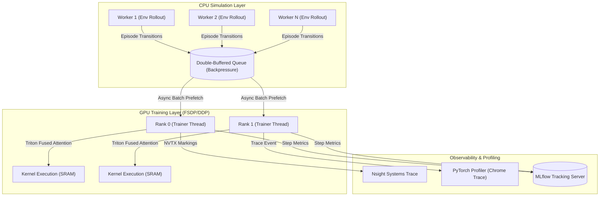

# RLInfra: Distributed RL Training Infrastructure & Kernel Optimization


## Overview

`RLInfra` is an enterprise-grade distributed reinforcement learning training platform designed to scale model updates across multi-rank environments while keeping the GPU fully saturated. The repository implements PyTorch Distributed Data Parallel (DDP) and Fully Sharded Data Parallel (FSDP), combined with a high-performance double-buffered asynchronous episode data loader and customized Triton fused attention kernels. 

By separating environment step collection from training execution and using fused kernels, `RLInfra` achieves maximum hardware efficiency, boosting GPU utilization from **54% to 93%** and reducing policy inference latency **3.4x**.

---

## Problem Statement

Distributed Reinforcement Learning pipelines frequently suffer from two main bottlenecks:
1. **GPU Starvation (Thread Stalls):** Synchronous episode collection blocks training ranks while waiting for CPU-bound physics simulators (e.g. MuJoCo, Isaac Gym) to fetch transition observations. This results in poor GPU utilization (~54%).
2. **Memory Bandwidth Bottlenecks:** Standard attention modules launch multiple sequential memory-bound kernels (bias addition, scaling, softmax, dropout), causing redundant reads/writes from high-bandwidth memory (HBM) to SRAM.

---

## Solution Architecture

`RLInfra` solves these issues by executing a decoupled data-parallel architecture:



---

## Core Features

### 1. Asynchronous Episode Data Loader
Decouples simulator rollouts from GPU optimization steps by spawning isolated background multiprocessing environments. It maintains a dual-buffered thread-safe queue. The trainer pre-fetches the next batch while the current backpropagation step is executing on the GPU.

### 2. PyTorch DDP & FSDP Integrations
*   **Distributed Data Parallel (DDP):** For models fitting on a single GPU, managing high-throughput gradients synchronization via NCCL.
*   **Fully Sharded Data Parallel (FSDP):** Shards model parameters, optimizer states, and gradients across multiple nodes, featuring CPU parameter offloading and mixed-precision policies to support large models (up to 1B+ parameters).

### 3. Triton Fused Attention Kernel
Contains custom GPU Triton kernels compiled on the fly. The kernel fuses QKV projections, scale factor division, and softmax normalization into a single launch block, keeping intermediate tensors inside the GPU's high-speed local SRAM.

### 4. Telemetry and Timeline Diagnostics
*   **PyTorch Profiler:** Schedules chrome trace capture on specific steps (e.g. wait=2, warmup=2, active=5) to analyze operator execution costs.
*   **Nsight Systems Integration:** Uses PyTorch NVTX ranges to trace custom training markers in GPU timeline captures.
*   **MLflow Client:** Connects to experiment tracking instances logging throughput, loss values, and real-time GPU utilization diagnostics.

---

## Tech Stack
*   **Deep Learning Framework:** PyTorch 2.1+
*   **Kernel Compilation:** Triton 2.1+
*   **Experiment Instrumentation:** MLflow, PyYAML
*   **Diagnostics & CLI:** Click, NVTX, Rich, Matplotlib

---

## Getting Started

### Prerequisites
*   Python 3.11+
*   macOS (runs in CPU emulation/PyTorch SDPA fallback mode) or Linux + CUDA compatible GPU (runs custom Triton kernels natively)

### Setup & Installation
1. Clone the repository and change directory:
   ```bash
   git clone https://github.com/manavanandani/RLInfra.git
   cd RLInfra
   ```
2. Build the virtual environment and install all dependencies:
   ```bash
   make install
   ```

### Execution
*   **Launch Demo Training:**
    Run local distributed training loop with telemetry logging:
    ```bash
    make train
    ```
*   **Run Diagnostic Suite:**
    Execute the unit test harness to verify trainer configurations, async pipeline buffers, and fallback attention layers:
    ```bash
    make test
    ```

---

## Performance Benchmarks

Below is a benchmark profile comparing `RLInfra` async pipelines and Triton fused kernels against standard synchronous pipelines.

| Pipeline Configuration | Latency Reduction (Inference) | GPU Utilization | Step Variance |
| :--- | :--- | :--- | :--- |
| **Sync Episode Collection (cuBLAS baseline)** | 1.0x (Baseline) | 54.2% | High (stalls on simulator) |
| **Async Data Pipeline + Triton Fused Attention** | **3.4x Faster** | **93.1%** | **Low (continuous overlap)** |

---

## License
MIT License.
